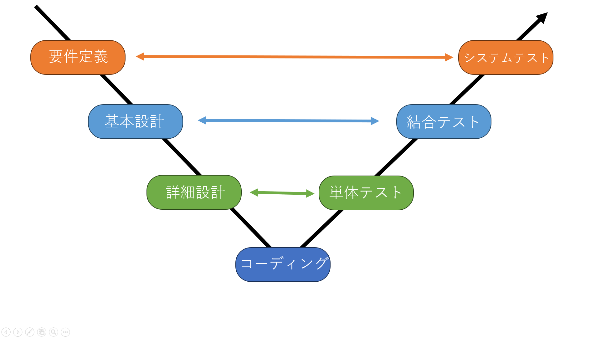

# **注意**

製作途中です
# **ソースコードを書く前に**

ソフトウェアの話をする前に前提とした開発環境や開発の進め方等の話をしようと思います。

開発環境は使う言語によって違いますが、まずはWindows、Linux等に入れてHello Worldのようなサンプルプログラムを実行してうまくいっているか確認しておきましょう。

その後、操作に慣れておきましょう。基本的にロボット作成においてソフトウェアは最後にくるものです。そのため担当がソフトウェアのみの場合、最初の方はあまりすることがないので、その空いた時間にほかのタスクを行ったり、技術に慣れておくと良いかもしれないです。

次に開発の進め方を考えていきましょう。

まず、はじめに一般の大型システムを構築する際にはどのような手法を用いるのか考えてみましょう。

実際の会社ではウォーターモデルやV字型モデルといった方法が使われています。

イメージは↓の通り

 

- 要件定義
    - どんな機能を作るか決めること
- 基本設計
    - 画面構成など大まかな配置や関数の内容を決める
- 詳細設計
    - より細かい処理の内容を決める
- コーディング
    - プログラミングする
- 単体テスト
    - 作った関数などが正しく動くか確認
- 結合テスト
    - 組み合わせて、期待通りに動くことの確認
- システムテスト
    - システムを動かしてみて最初に作りたかったものと一致しているか確認

ポイントは上から順番に実行していき、同じ高さのものに対応するテストを行う事で品質を保証するというものです。これを行うときちんとしたものが作れます。

しかし、要件定義がコロコロと変わると毎回最初まで戻らないといけないので、なるべく戻らなくても良いように最初の段階で決めておけると良いです。ですが、実際にロボットを作ってみると、うまくいかないことが出てきてシステムの改修が入ってきて最初からやり直しになったり、関数の引数をまるっと変えたりする必要が出てきます。

ここで、どうやったら時間を短く作れるかを考えてみましょう。

ポイントはテストを簡略化することです。

一般のシステム開発において、時間がかかるのは要件定義とテストです。要件定義は削れませんがテストは少ない項目で正常になっていることを確認して、使ってみてフィードバックをもらうという形式にするのが良いと思います。

例外処理を設定することで適切な入力以外をはじき、運用できるようにすればテスト時に正常時の確認のみで良くなります。

また、実際に使う人は悪意を持って攻撃してくるわけではないのでそのような対策の作成やテストはあまり必要ありません。(例外処理はきちんと作っておくこと(暴走するので))

# システム開発の手順

ソフトウェアが必要だと分かったら、作成に移っていきましょう。

機体を作ることでも、プログラムを書くことでも大切なのは設計です。

まず、どんなものを作るのかをきちんと決めて他人が読んでも分かるようにしましょう。

ここを丁寧に、明確にしておくことで後で非常に楽になります。(自分だけが使うわけではないので使う人の要求をはっきりとさせるためにしっかりと話し合いましょう。)

その後、コーディングしてコンパイルが通ることを確認したら、正常に動くときの数パターンを検証して想定通りの動きになっているか確認しましょう。(事前に正常動作は計算しておきましょう。)

また、例外処理もうまくいっているか発生させられる場合は確認しましょう。もし、ロボットを壊す可能性がある場合は慎重に行いましょう。

ここまで行なったら、実際に使ってみてフィードバックをもらい調整していきましょう。
