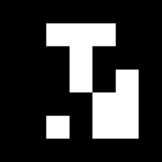
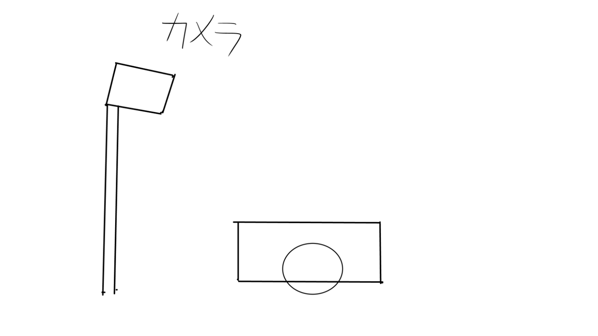

# ソフトウェアとセンサー

世の中には様々なセンサーがあり、世の中の様々な情報を受け取ることができます。このセンサーからデータを受け取り変換することで有用な情報を受け取ることができます。しかし、適切な変換を行わないと意味をほとんど持たないことが多いです。

例えば、今回使用例で説明するARマーカーは座標を適切に変換しないと大まかにどこら辺にいるかどうかしかわかりません。より具体的に言えば、x座標の値が大きくなったら右に行ったのは分かるけど、どのくらい右に行ったのか分からないみたいな。

具体的に問題になるのは、pythonで処理をすると2次元の画像上のピクセル値(左上が原点)になり、実際の位置が分からなくなります。こういう処理をロボット作成においては行う必要があります。

そこでその値の閾値を適切に取り、自分たちで意味を持たせることによってより制御ができるようになります。(これは、モーターの制御などでも同様です)

後に示す具体例では、現実での距離の実測値とコンピューターの画面上の座標値を射影変換する行列を作成することで、カメラからのロボットの位置を推定する方式を行いました。

# **実際にあった失敗**
- 画像の座標の原点がどこにあるか分からない。
  + これは、プログラミング言語によってデフォルトで設定されています。これをきちんと確認しておかないと、左上を原点にした状態で座標を計算していて測定がやり直しになりました。

- スケールが間違ってて、定数倍しないといけない。
  + 映像を表示するときのデフォルトのサイズと画像の表示のデフォルトのサイズが違って、奥行きの計算が合わなかった。(最後の方まで分からないことが多い)

- 画像には見えない部分の計算を無理やり変換しようとした
  + 普通に相似比から計算すればよかった。

出力値のログなどを取りながらデバックすることで、解決しやすいです。というか、常に値は見れるようにPrintするのを推奨します。


# **ARマーカーについて**

まず、ARマーカーとは何でしょうか？

ARマーカーとはAR(拡張現実)という技術を行う上での目印です。ARとは拡張現実といい、特定のマーカーを読み取るとそこに映像を投影したりして、現実に存在しているかのようにする技術です。今回はその中でもマーカーを読み取る技術に注目して用いました。

ARマーカーの画像はこんな感じです。

 

見た目はQRコードに似ているけど、実際にはちょっと異なっています。中には数字やURLなどの情報を入れることができます。最近では、読み込んだら特定の動画を流すなど色々なことができます。また、このタイプのARマーカーには向きが存在しておりきちんと間違えないで読むことができるようになっています。

実際には、他にも色を用いた多色ARマーカーなどもあります。(情報量を増やせる。識別レベルではあまり必要がないけれど)

最近のARマーカーの技術では、任意の画像で同様のことを行う事が出来るようになっています。

ここで、みなさん思ったことがあるでしょう、それはQRコードで良いのでは？と

実際に使ってみると分かるのですが、QRコードは読み込む条件がPythonだと結構厳しいです。

おとなしくARマーカー（既存のOpencvのArUcoマーカーがおすすめ）か画像解析、機械学習を使うのが良いと考えます。

# **使用例**

具体的に、実際に作ったものを紹介します。

ロボットの上部に設置したARマーカーをカメラから情報として受け取り、それを事前に用意した変換行列をもとに変換して現実の座標を求め、ロボットの自己位置を判定するようなものを作りました。

イメージとしては以下の通り

 

このような形でロボットにARマーカーを設置する。

 

角度を固定したカメラで読む。そのデータを以降に示すPythonで処理する。

 

画像上の座標と現実の座標を変換することで、画像のみで実際の距離を推定することができる。

ソースコードは以下の通り↓

```python
# opencvとaruco,行列用のnumpyを用意
import cv2
import cv2.aruco as aruco
import numpy as np
from collections import defaultdict

# ===== 射影変換行列 =====
# 実測値を用いている。
pts1 = np.array([(121, 333), (185, 96), (409, 102), (481, 334)], dtype=np.float32)
pts2 = np.array([(-304, 913), (-304, 1842), (304, 1842), (304, 913)], dtype=np.float32)
M = cv2.getPerspectiveTransform(pts1, pts2)
# Mが変換行列

# ===== カメラパラメータ =====
cameraMatrix = np.array([[1452.1857, 0., 626.778949],
                         [0., 1452.27677, 451.452723],
                         [0., 0., 1.]], dtype=np.float64)
distCoeffs = np.array([0.09215690, 0.51481344, 0.02651601, -0.00706794, -3.74512909], dtype=np.float64)

# ===== ArUco設定 =====
aruco_dict = aruco.getPredefinedDictionary(aruco.DICT_5X5_1000)
parameters = aruco.DetectorParameters()
detector = aruco.ArucoDetector(aruco_dict, parameters)

# ===== Kalman フィルタークラス定義 =====
class SimpleKalman:
    def __init__(self):
        self.kalman = cv2.KalmanFilter(4, 2)
        self.kalman.measurementMatrix = np.eye(2, 4, dtype=np.float32)
        self.kalman.transitionMatrix = np.array([[1, 0, 1, 0],
                                                 [0, 1, 0, 1],
                                                 [0, 0, 1, 0],
                                                 [0, 0, 0, 1]], dtype=np.float32)
        self.kalman.processNoiseCov = np.eye(4, dtype=np.float32) * 1e-2
        self.kalman.measurementNoiseCov = np.eye(2, dtype=np.float32) * 1e-1
        self.initialized = False

    def update(self, x, y):
        measurement = np.array([[np.float32(x)], [np.float32(y)]])
        if not self.initialized:
            self.kalman.statePre = np.array([[x], [y], [0], [0]], dtype=np.float32)
            self.initialized = True
        self.kalman.correct(measurement)
        prediction = self.kalman.predict()
        return float(prediction[0]), float(prediction[1])

# ===== Kalmanフィルター保持辞書 =====
kalman_filters = defaultdict(SimpleKalman)

# ===== メイン関数 =====
def detect_aruco_and_get_real_positions(image_path: str,target_ids=[7, 8, 29]) -> dict:
    """
    ArUcoマーカーの補正済み位置を射影変換し、Kalmanフィルターで平滑化して返す。
    出力: {id: (X, Y)} ← 実世界座標（mm）。未検出は (0.0, 0.0)
    スケーリングは x, y 共に 73/84 を適用。
    """
    #nparr = np.frombuffer(image_bytes, np.uint8)
    #img = cv2.imdecode(nparr, cv2.IMREAD_COLOR)
    img = cv2.imread(image_path)
    if img is None:
        raise ValueError("画像読み込みに失敗しました")

    # 歪み補正とグレースケール変換
    undistorted = cv2.undistort(img, cameraMatrix, distCoeffs)
    gray = cv2.cvtColor(undistorted, cv2.COLOR_BGR2GRAY)

    # ArUco 検出
    corners, ids, _ = detector.detectMarkers(gray)
    results = {tid: (0.0, 0.0) for tid in target_ids}

    if ids is not None:
        aruco.drawDetectedMarkers(undistorted, corners, ids)
        for i in range(len(ids)):
            marker_id = ids[i][0]
            if marker_id in results:
                # マーカー中心座標の計算と透視変換
                center_2d = corners[i][0].mean(axis=0).astype(np.float32).reshape(-1, 1, 2)
                real = cv2.perspectiveTransform(center_2d, M)
                x, y = real[0][0]

                # Kalmanフィルターで平滑化
                x_filt, y_filt = kalman_filters[marker_id].update(x, y)

                # スケーリングして登録（変更しないとの指定）
                results[marker_id] = ((73 * y_filt / 84)/1000, (-1)*(73 * x_filt / 84)/1000)

    return results
```

既存のライブラリの関数を用いて、かなり簡潔に書いている。

流れとしては、入力された画像に対して処理を施し、指定したマーカーを探索し、あったらその座標を変換して返すという事をしています。

Kalmanフィルターを一応付けて、精度向上を図りました。(調べながらやったので間違っているかもしれません)


